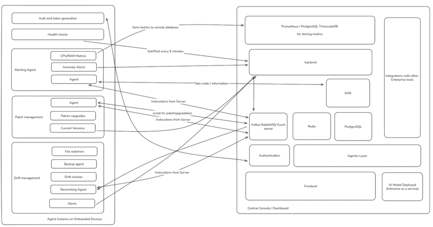
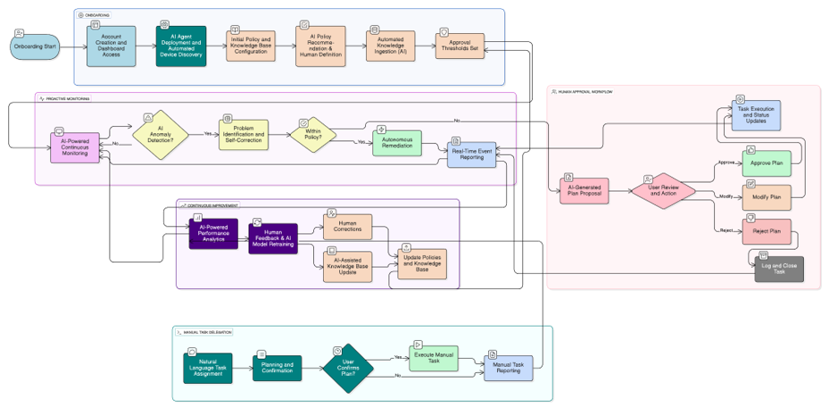

# AURA
## Autonomous Unified Resource Agent - Backend Core


<p align="">
  <strong> Intelligent IT Infrastructure Management Through Autonomous Agents</strong>
</p>

---

##  Overview

**AURA-Agent** is the powerful backend engine of the AURA (Autonomous Unified Resource Agent) system - a revolutionary IT infrastructure management platform that transforms traditional reactive "break-fix" IT operations into proactive, self-healing autonomous systems.

###  Mission Statement
Transform IT infrastructure management from manual, reactive operations to intelligent, autonomous, and predictive management through AI-powered agents.

---

##  Architecture Diagram



---

##  Process Flow Diagram



---

##  Quick Start

### Prerequisites

- Python 3.8+
- PostgreSQL 12+


### Installation

#### Deployment Setup
```bash
# Clone the repository
git clone https://github.com/Singhharpreet03/AURA-Autonomous-Unified-Resource-Agent.git
cd aura-core

# Create virtual environment
python -m venv venv
source venv/bin/activate  # On Windows: venv\Scripts\activate

# Install dependencies
pip install -r requirements.txt

# Set up environment variables
cp .env.example .env
# Edit .env with your configuration

# Start the services
python fast_api_all.py
```

#### Production Deployment
```bash
PACKAGE_FILE="./AURA-agent-0.1.0.tar.gz"

# 1. Install Dependencies
sudo apt update
sudo apt install -y python3 python3-pip

# 2. Install the Python Package
echo "Installing Python package..."
sudo python3 -m pip install $PACKAGE_FILE

# 3. Create Secure Directories
echo "Creating secure directories..."
sudo mkdir -p /etc/aura/
sudo mkdir -p /var/agent/scripts/
sudo chown root:root /var/agent/scripts/
sudo chmod 700 /var/agent/scripts/

# 4. Set up systemd Service (Copy your AURA.service file and enable it)
echo "Setting up systemd service (Requires AURA.service file)..."
# Replace with the actual path to your service file
sudo cp AURA.service /etc/systemd/system/
sudo systemctl daemon-reload
sudo systemctl enable AURA.service 
sudo systemctl start AURA.service

echo "Installation complete. AURA Agent service started."
```

### Environment Configuration

```env
# Database Configuration
DB_HOST=localhost
DB_PORT=5432
DB_USER=postgres
DB_PASSWORD=your_password
DB_NAME=aura_core

# API Configuration
API_HOST=0.0.0.0
API_PORT=8040
DEBUG=True

# Security
SECRET_KEY=your-secret-key-here
ENCRYPTION_KEY=your-encryption-key-here

# Monitoring
CRITICAL_APPLICATIONS=web_server,api_gateway,database
BASELINE_UPDATE_INTERVAL=300
```

---


##  Core Features

### 1.  Agentic Patch Management

**Intelligent, autonomous patch deployment with learning capabilities.**

- **Smart Patch Planning**: Analyzes system state, dependencies, and business hours
- **Adaptive Deployment**: Phased rollouts with automatic rollback on failures
- **No-Code Playbooks**: Pre-configured and custom workflow creation
- **Predictive Scheduling**: ML-powered optimal timing prediction

```python
# Example: Creating a patch workflow
POST /api/v1/workflow/create
{
  "instructions": "Update nginx to latest version with zero downtime",
  "script_type": "bash",
  "encrypted": true
}
```

### 2.  Intelligent Anomaly Detection

**Advanced ML-powered behavioral analysis and anomaly identification.**

- **Multi-Algorithm Detection**: Isolation Forest, Prophet forecasting, statistical analysis
- **Contextual Alerting**: Behavior-based alerts vs. simple threshold monitoring
- **Correlation Analysis**: Cross-metric pattern recognition
- **Adaptive Learning**: Continuous model improvement

```python
# Real-time anomaly detection flow
Metric Stream → Behavioral Baseline → Anomaly Detection → Enriched Alerts → Remediation
```

### 3.  Behavioral Baseline Learning

**Dynamic baseline establishment for normal system behavior.**

- **Application-Specific Learning**: Individual behavior profiles per application
- **Temporal Pattern Recognition**: Seasonal and trend analysis
- **Resource Usage Modeling**: CPU, memory, disk, network patterns
- **Predictive Capacity Planning**: Resource requirement forecasting

### 4.  Drift & Integrity Management

**Autonomous file integrity monitoring and configuration drift prevention.**

- **Real-time File Monitoring**: Watchdog-based change detection
- **Cryptographic Integrity**: Blake3 hashing for tamper detection
- **Automatic Remediation**: Instant file restoration from secure backups
- **Audit Trail**: Complete change history and attribution

```bash
# Monitor file integrity
GET /api/files/status
POST /api/pipeline/start  # Start monitoring
POST /api/baseline/rebuild  # Update baseline
```

### 5.  Real-time Alert Orchestration

**Intelligent alert management with correlation and enrichment.**

- **Multi-Channel Notifications**: WebSocket, email, Slack, Teams
- **Alert Correlation**: Related event grouping and deduplication
- **Severity Classification**: ML-based impact assessment
- **Automated Escalation**: Smart routing and response orchestration

### 6.  Autonomous Remediation Engine

**Self-healing infrastructure through intelligent automated responses.**

- **Policy-Driven Actions**: Configurable response automation levels
- **Safe Execution**: Built-in safeguards and human-in-the-loop controls
- **Learning from Experience**: Remediation success tracking and optimization
- **Rollback Capabilities**: Automatic undo on remediation failures

---

##  API Reference

### Core Endpoints

#### System Status
```http
GET /api/status
```
Returns system health and component status.

#### File Management
```http
GET /api/files
GET /api/files/{path}/status
POST /api/files/{path}/check
```
File integrity monitoring and drift detection.

#### Pipeline Control
```http
POST /api/pipeline/start
POST /api/pipeline/stop
```
Control the autonomous monitoring pipeline.

#### Baseline Management
```http
POST /api/baseline/rebuild
```
Rebuild behavioral baselines from current system state.

#### Backup Management
```http
GET /api/backups
POST /api/backups
POST /api/backups/latest/restore
```
Manage system backups and restoration.

#### Alert Management
```http
GET /api/v1/alerts
GET /api/v1/alerts/{id}
POST /api/v1/alerts/{id}/acknowledge
GET /api/v1/alerts/stats
```
Comprehensive alert management with filtering and statistics.

#### Workflow Management
```http
GET /api/v1/workflows/
POST /api/v1/workflow/create
POST /api/v1/workflow/patch/{id}
DELETE /api/v1/workflow/{id}
```
Patch workflow creation and execution.

#### WebSocket APIs
```http
WS /ws/live          # Real-time drift alerts
WS /ws/alerts        # Real-time anomaly alerts
```

---

##  Technology Stack

| Component | Technology | Purpose |
|-----------|------------|---------|
| **API Framework** | FastAPI | High-performance REST API |
| **Database** | PostgreSQL | Primary data storage |
| **ML Framework** | scikit-learn, Prophet | Anomaly detection algorithms |
| **Embedding** | Sentence Transformers | Text analysis and correlation |
| **Monitoring** | Watchdog | File system monitoring |
| **Encryption** |  Cryptographic hashing, JWT  | Secure script storage and backups |
| **Async** | asyncio | Concurrent processing |
| **WebSocket** | fastapi.websocket | Real-time communication |
| **Logging** | Python logging | Comprehensive audit trails | 


---

##  Monitoring & Observability

### Metrics Collection
- **System Metrics**: CPU, memory, disk, network utilization
- **Application Metrics**: Response times, error rates, throughput
- **Business Metrics**: Patch success rates, alert accuracy, remediation effectiveness

### Logging Structure
```json
{
  "timestamp": "2025-11-02T10:30:45.123Z",
  "level": "INFO",
  "service": "anomaly_detection",
  "event": "baseline_updated",
  "application": "web_server",
  "details": {
    "accuracy": 0.95,
    "data_points": 1440
  }
}
```

### Health Checks
```http
GET /health/ready    # Readiness probe
GET /health/live     # Liveness probe
GET /metrics         # Prometheus metrics
```

<p align="center">
  <strong>Built with ❤️ by the MIRAI Team</strong>
</p>

---

